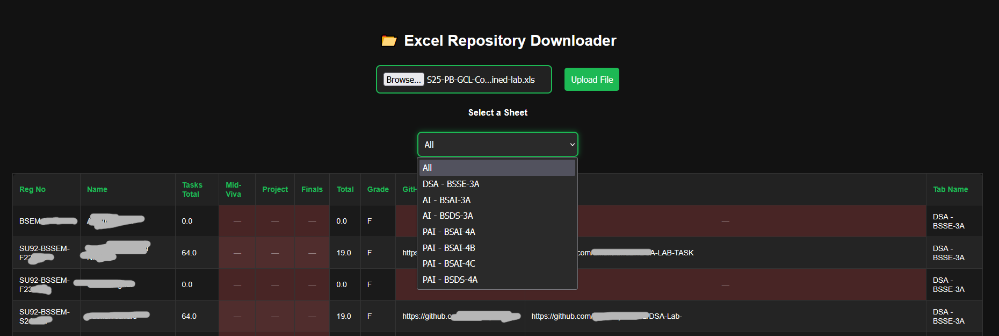
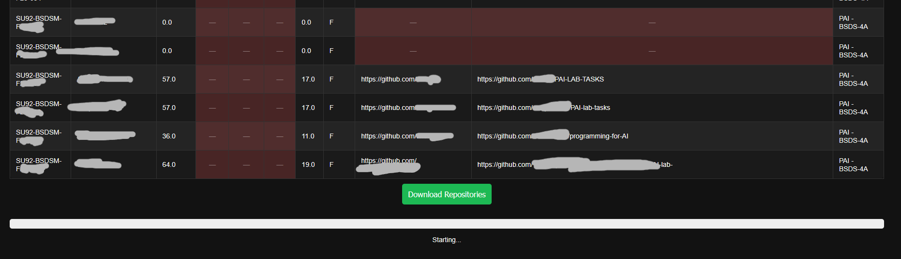

# 📂 Bulk Git Repo Downloader

A web-based tool to **automatically download multiple GitHub repositories** listed in Excel sheets — built for classroom or batch processing use cases.  
Originally developed for managing student projects at **Superior University**, this app streamlines the process of downloading GitHub repos using data from structured Excel sheets (including support for multiple sheets).

---

## 🎓 Features

- Upload `.xls` or `.xlsx` Excel files
- Select specific sheets or **process all sheets** together
- Automatically reads GitHub Repo URLs and downloads them as `.zip`
- Smart filtering to remove unnecessary columns (like weekly tasks)
- Elegant UI with dark mode styling and real-time progress updates
- Works out-of-the-box — no login or GitHub token required

---

## 📦 Installation

1. **Clone the repository**
   ```bash
   git clone https://github.com/RasikhAli/Bulk-Git-Repo-Downloader.git
   cd Bulk-Git-Repo-Downloader
   ```

2. **Create a virtual environment** (optional but recommended)
   ```bash
   python -m venv venv
   source venv/bin/activate  # On Windows: venv\Scripts\activate
   ```

3. **Install dependencies**
   ```bash
   pip install -r requirements.txt
   ```

4. **Run the app**
   ```bash
   python app.py
   ```

5. **Open in browser**
   Navigate to `http://localhost:5000`

---

## 📁 Folder Structure

```
.
├── app.py                  # Main Flask backend
├── assets/
│   ├── screenshot1.png
│   └── screenshot2.png
├── uploads/                # Temporary uploaded Excel files
├── downloads/              # Downloaded .zip files for GitHub repos
├── templates/
│   └── index.html          # Main HTML page
├── static/
│   ├── script.js           # Frontend logic
│   └── styles.css          # UI styling (dark mode)
├── requirements.txt
└── README.md
```


## 📸 Screenshots

Here’s a quick preview of the app in action:

### 🧾 Upload Excel + Choose Sheet


### 📦 Downloading Repositories with Progress Bar



---

## 📊 Excel Format Guidelines

Your Excel sheets must contain a `GitHub Repo` column.  
The app also expects (but does not strictly require):

- `Reg No` (Registration Number)
- `Name` (Student Name)

🧠 Tip: Place the main data starting from **Row 12**, as the app skips the top 11 rows (to accommodate headers/titles).

---

## 🔐 No Credentials Required

The app downloads public GitHub repos using direct `.zip` links.  
For private repositories, you'd need to modify the script to use [GitHub's API with tokens](https://docs.github.com/en/rest).

---

## 🛠 Built With

- 🐍 Python + Flask
- 📊 pandas for Excel parsing
- 💾 requests for GitHub .zip downloads
- 🖥 HTML/CSS/JS (jQuery)
- 🎨 Custom Dark Mode UI

---

## 📚 License

This project is for educational and personal use.  
Feel free to modify and share with credit.

---

## 🙏 Acknowledgments

Created by an instructor for the students of **Superior University**  
Helping streamline GitHub-based project submissions.
